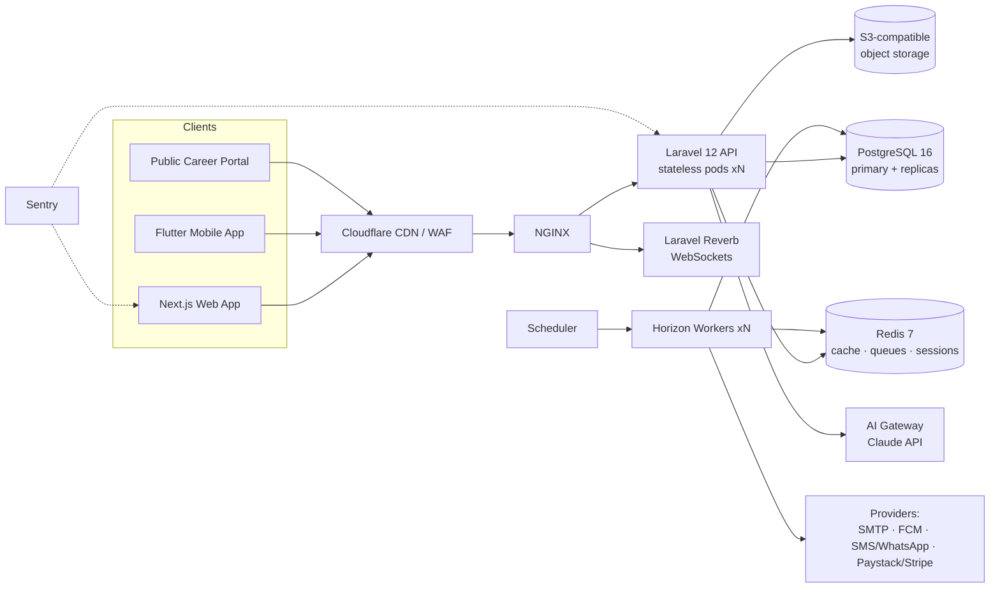

# Go3net Office — System Architecture

## 1. High-Level Topology



**Principles:** API-first · stateless web tier · everything async that can be async · tenant isolation at the ORM layer · module boundaries enforced by code structure + feature flags.

## 2. Backend Architecture (Laravel 12)

### 2.1 Modular monolith

A modular monolith (not microservices) — one deployable, hard internal boundaries. Each module lives in `app/Modules/<Name>` and may only talk to other modules through **contracts (interfaces) and domain events**, never by reaching into another module's models. This keeps v1 operationally simple while preserving a future extraction path to services.

```
apps/api/app/
├── Core/                      # shared kernel
│   ├── Tenancy/               # Tenant model, BelongsToTenant trait, TenantScope, resolver middleware
│   ├── Auth/                  # Sanctum, 2FA, OAuth, device sessions
│   ├── Authorization/         # roles, permissions, policies base
│   ├── Audit/                 # Auditable trait, audit log writer
│   ├── Modules/               # module registry + EnsureModuleEnabled middleware
│   ├── Http/                  # ApiController base, ApiResponse, pagination
│   └── Support/               # DTO base, helpers
├── Modules/
│   ├── Hr/
│   │   ├── Http/Controllers · Requests · Resources
│   │   ├── Models/
│   │   ├── Services/          # business logic (thin controllers)
│   │   ├── Repositories/      # query encapsulation
│   │   ├── DTOs/
│   │   ├── Events/ · Listeners/ · Jobs/
│   │   ├── Policies/
│   │   ├── Database/Migrations · Seeders · Factories
│   │   └── routes.php
│   ├── Projects/  Tasks/  Crm/  Finance/  Inventory/
│   ├── Lms/  Documents/  Chat/  Knowledge/  Helpdesk/
│   ├── Calendar/  Ai/  Dashboard/  Billing/
└── ...
```

**Layering (SOLID):** `Controller → FormRequest (validation) → Service (use-case) → Repository (persistence) → Model`. DTOs cross layer boundaries; Resources shape responses; Policies gate authorization; Events decouple side effects into queued Listeners/Jobs.

### 2.2 Multi-tenancy

- **Model:** shared database, shared schema, `tenant_id` column on every business table (best cost/ops profile at this scale; row-level security as defense-in-depth).
- `BelongsToTenant` trait adds a global `TenantScope` (`where tenant_id = current`) and auto-fills `tenant_id` on create.
- Tenant resolved per-request from subdomain (`acme.go3net.app`), `X-Tenant` header (mobile), or authenticated user's tenant — then bound into the container (`app(TenantContext::class)`).
- PostgreSQL **RLS policies** on sensitive tables as a second wall: even a missed scope cannot leak rows.
- Storage keys prefixed `tenants/{id}/…`; cache keys prefixed `t{id}:…`; queue payloads carry tenant id and workers rebind context.
- **Scale-out path:** largest tenants can be migrated to dedicated schemas/databases later — the `TenantContext` abstraction hides connection choice.

### 2.3 Module system

`modules` table (catalog) + `tenant_modules` (per-tenant toggle + plan gating). `EnsureModuleEnabled:{key}` middleware guards each module's route group; `GET /v1/me/bootstrap` returns enabled modules + permissions so clients render navigation dynamically.

### 2.4 Async & real-time

- **Queues:** Redis + Horizon; queues by concern: `default`, `mail`, `notifications`, `reports`, `payroll`, `ai`, `webhooks`. Payroll runs, report exports, OCR, AI generation, provider sends are always queued.
- **Scheduler:** attendance auto-close, leave accruals, SLA breach checks, birthday events, subscription dunning, DB backup trigger.
- **Real-time:** Laravel Reverb (WebSockets) with private tenant channels: `tenant.{id}.user.{id}` (notifications), `tenant.{id}.conversation.{id}` (chat), presence channels for online status.

### 2.5 AI subsystem

- `Ai\Gateway` wraps the Claude API (Messages API): model routing (Haiku-class for classification/extraction, Sonnet/Opus-class for generation/insight), token metering per tenant (credits), retries, cost logging.
- **Grounded answers:** retrieval layer queries Postgres full-text (v1; pgvector embeddings v2) across employees, documents (OCR text), KB, policies — always filtered through the caller's RBAC before reaching the prompt.
- **Document generation:** templates with merge fields + AI drafting; outputs rendered to PDF via headless Chromium.
- Prompt-injection posture: retrieved tenant content is data, never instructions; tool-use is allowlisted per feature.

## 3. Frontend Architecture (Next.js 15)

```
apps/web/src/
├── app/
│   ├── (auth)/login · register · forgot-password · two-factor
│   ├── (app)/                 # authenticated shell: sidebar + topbar
│   │   ├── dashboard/
│   │   ├── hr/ (employees, attendance, leave, payroll, assets, recruitment…)
│   │   ├── projects/ · tasks/ · crm/ · finance/ · …
│   │   └── settings/ (profile, security, tenant, modules, roles, billing)
│   └── api/                   # route handlers (BFF: token cookie exchange)
├── components/
│   ├── ui/                    # shadcn/ui primitives (design-system themed)
│   ├── layout/                # AppShell, Sidebar, Topbar, CommandPalette
│   ├── charts/ · data-table/ · forms/
│   └── modules/<module>/      # module feature components
├── lib/                       # api client (fetch wrapper), auth, utils, cn
├── hooks/                     # TanStack Query hooks per module
├── stores/                    # zustand ui state (sidebar, theme, palette)
└── styles/                    # tokens.css, globals
```

- **Data:** TanStack Query for all server state (stale-while-revalidate, optimistic updates for tasks/kanban/chat); React Hook Form + Zod for forms (Zod schemas mirror API validation).
- **Rendering:** server components for shells/static data, client components for interactive islands; route-level code splitting; `next/font` Inter self-hosted.
- **Design system:** CSS custom-property tokens (light/dark/system via `next-themes`), shadcn/ui restyled to Go3net tokens, Framer Motion micro-animations (150–250 ms, ease-out), skeleton loaders everywhere.
- **Auth:** HttpOnly cookie session against API; middleware guards `(app)` routes; permissions from `/me/bootstrap` drive nav + component-level gating (`<Can permission="hr.employees.view">`).

## 4. Mobile Architecture (Flutter)

- Clean architecture: `presentation / domain / data` per feature; Riverpod for state; Dio + interceptors (auth, tenant header, retry).
- **Offline-first:** Drift (SQLite) local cache; mutation outbox with background sync + conflict policy (server wins, client notified); attendance clock-ins queue offline and sync with GPS/timestamp captured locally.
- Push via FCM; QR attendance via camera; biometric app-lock; payslip PDF viewer; chat over the same WebSocket protocol.

## 5. Billing & Licensing

- `plans` → `subscriptions` (per tenant) → `invoices`; Paystack + Stripe adapters behind a `PaymentGateway` contract; webhooks reconcile state; seat counting from active employees; grace periods and dunning emails; feature/module entitlements resolved from plan + overrides.
- White-label: tenant `branding` JSON (logo, colors, sender identity) + custom domain mapping table consumed by Next.js middleware and email layer.

## 6. Observability & Ops

- Sentry (API + web + mobile), Telescope (non-prod), Horizon dashboard, `/up` health endpoint, structured JSON logs to stdout (Docker), request-id correlation header propagated from Cloudflare through NGINX to logs.
- Deploy: GitHub Actions → build Docker images → push registry → deploy (compose/Swarm v1, Kubernetes-ready). Zero-downtime via rolling restart + `php artisan migrate --force` gated by pre-deploy check.
