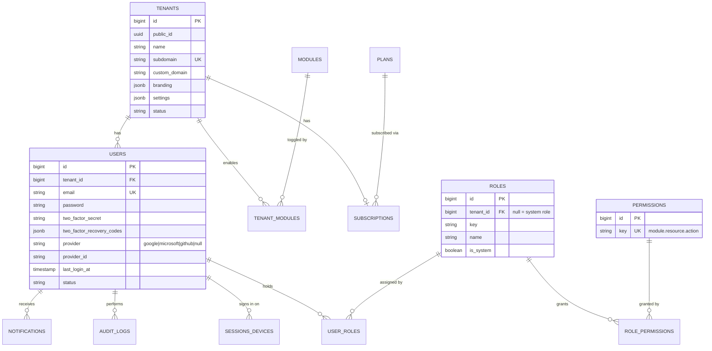
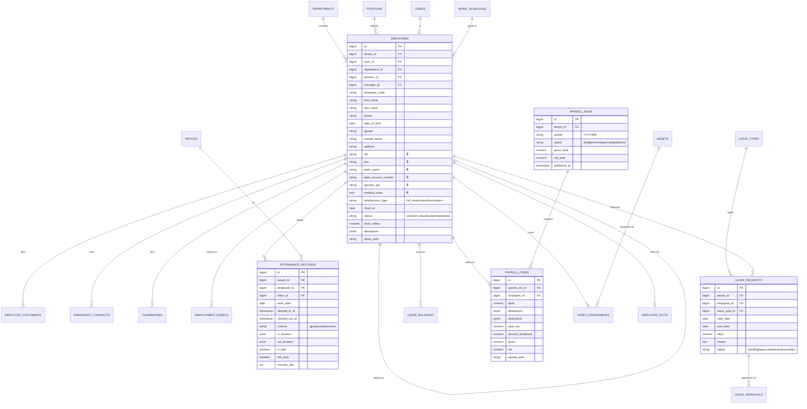
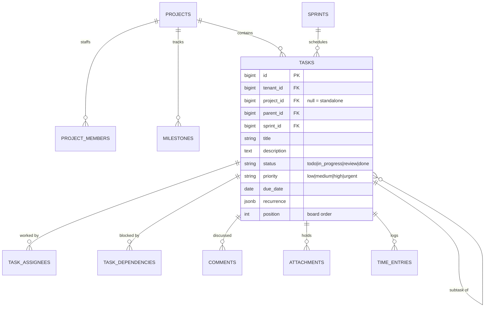

# Go3net Office — Database Schema & ERD

PostgreSQL 16. Conventions: `bigint` identity PKs, `uuid public_id` for API exposure, `tenant_id` FK on every business table (indexed, part of most composite indexes), `created_at/updated_at`, soft deletes (`deleted_at`) on user-facing entities. Sensitive columns (marked 🔒) are AES-256 encrypted via Laravel encrypted casts.

## 1. Core ERD (identity, tenancy, RBAC, billing)

## 2. HR ERD

## 3. Work management ERD (projects, tasks)

## 4. Remaining domains (summary)

| Domain | Tables |
|---|---|
| CRM | `leads`, `clients`, `deals`, `pipeline_stages`, `crm_activities`, `follow_ups`, `proposals` |
| Finance | `finance_categories`, `transactions` (income/expense), `invoices`, `invoice_items`, `invoice_payments`, `purchase_orders`, `budgets` |
| Inventory | `products`, `suppliers`, `warehouses`, `stock_levels`, `stock_movements` |
| LMS | `courses`, `course_modules`, `lessons`, `enrollments`, `lesson_progress`, `quizzes`, `quiz_questions`, `quiz_attempts`, `certificates` |
| Documents | `folders`, `documents`, `document_versions`, `document_shares`, `document_approvals`, `tags`, `taggables` |
| Chat | `conversations`, `conversation_participants`, `messages`, `message_reactions`, `message_reads` |
| Knowledge | `kb_categories`, `kb_articles`, `kb_article_views` |
| Help Desk | `tickets`, `ticket_replies`, `sla_policies` |
| Calendar | `events`, `event_attendees`, `calendar_connections` (Google/Outlook OAuth) |
| Recruitment | `job_postings`, `candidates`, `applications`, `application_stages`, `interviews`, `interview_scorecards`, `offers` |
| Performance | `review_cycles`, `reviews`, `kpis`, `kpi_entries`, `okr_objectives`, `okr_key_results`, `feedback` |
| AI | `ai_conversations`, `ai_messages`, `ai_usage_logs`, `document_templates`, `generated_documents` |
| Billing | `plans`, `subscriptions`, `subscription_invoices`, `payment_methods`, `usage_records` |
| System | `audit_logs`, `notifications`, `notification_preferences`, `webhooks`, `api_keys`, `report_exports`, `ip_restrictions`, `password_histories` |

## 5. Indexing & integrity strategy

- Composite indexes lead with `tenant_id`: e.g. `(tenant_id, status)`, `(tenant_id, work_date, employee_id)` unique on attendance, `(tenant_id, period)` unique on payroll runs.
- Full-text: `tsvector` generated columns on employees (name/code/email), documents (OCR text), KB articles, tasks; GIN indexes. pgvector planned for AI retrieval (v2).
- FKs `ON DELETE RESTRICT` for financial/audit data, `CASCADE` only for pure children (e.g. invoice_items).
- Row-Level Security enabled on 🔒-bearing tables with `tenant_id = current_setting('app.tenant_id')::bigint` policy as defense-in-depth.
- Monthly partitioning candidates at scale: `attendance_records`, `audit_logs`, `messages`, `ai_usage_logs`.
