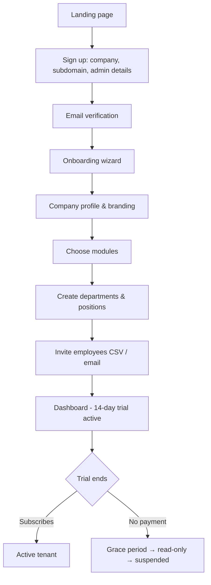
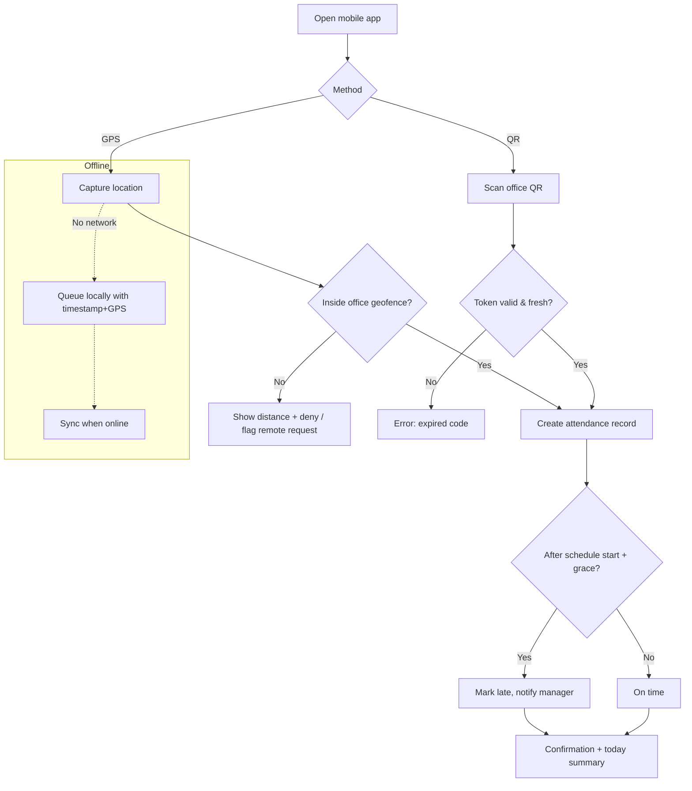
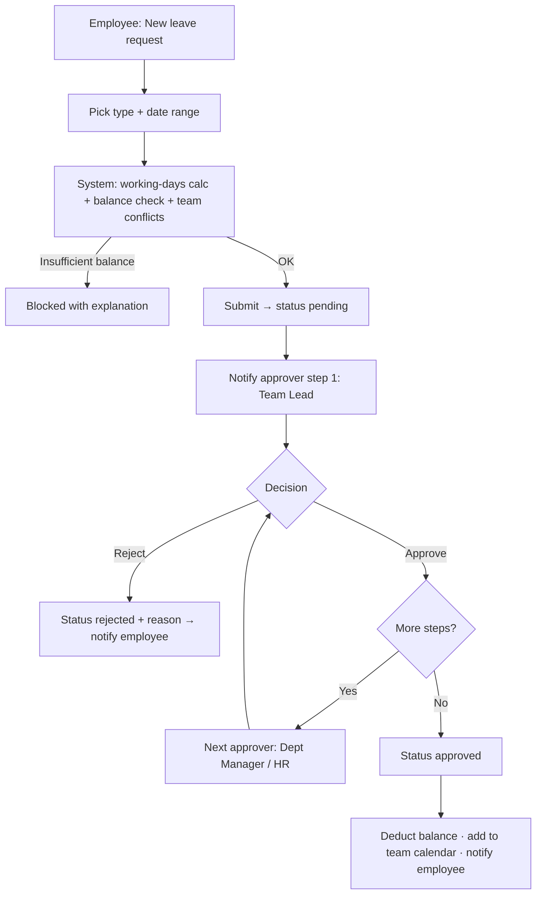
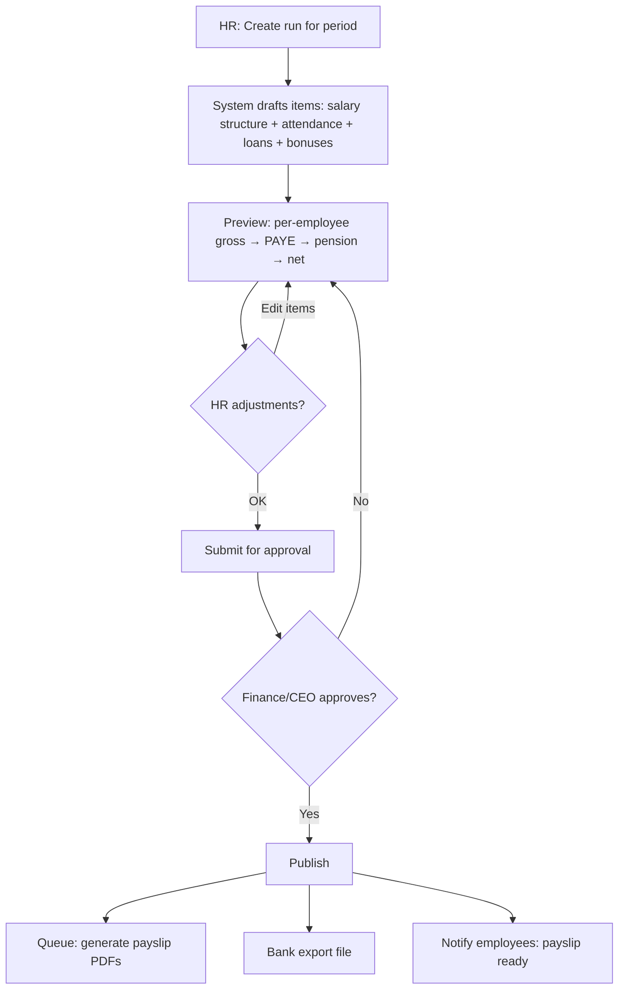
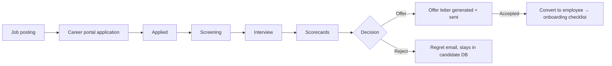
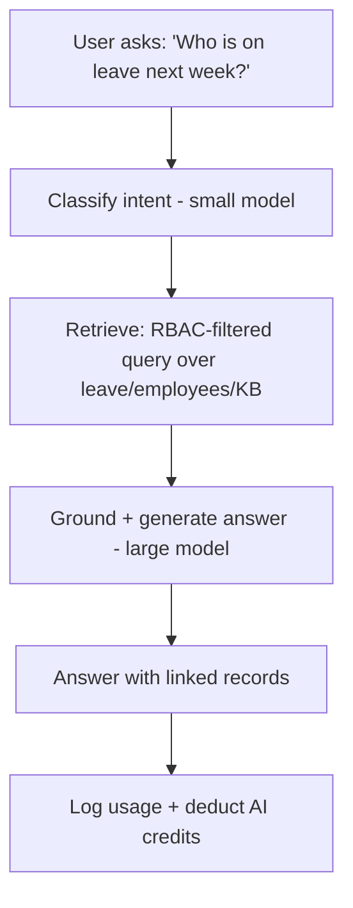
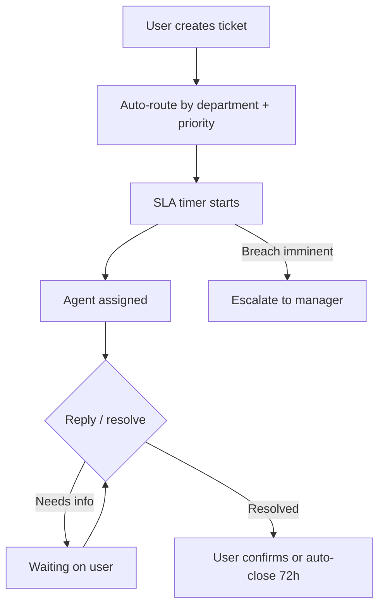

# Go3net Office — User Flow Diagrams

## 1. Tenant Signup & Onboarding

## 2. Employee Clock-In (GPS / QR)

## 3. Leave Request & Approval

## 4. Payroll Run

## 5. Recruitment Pipeline

## 6. AI Assistant Query

## 7. Help Desk Ticket

